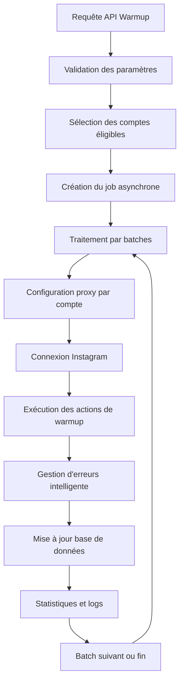
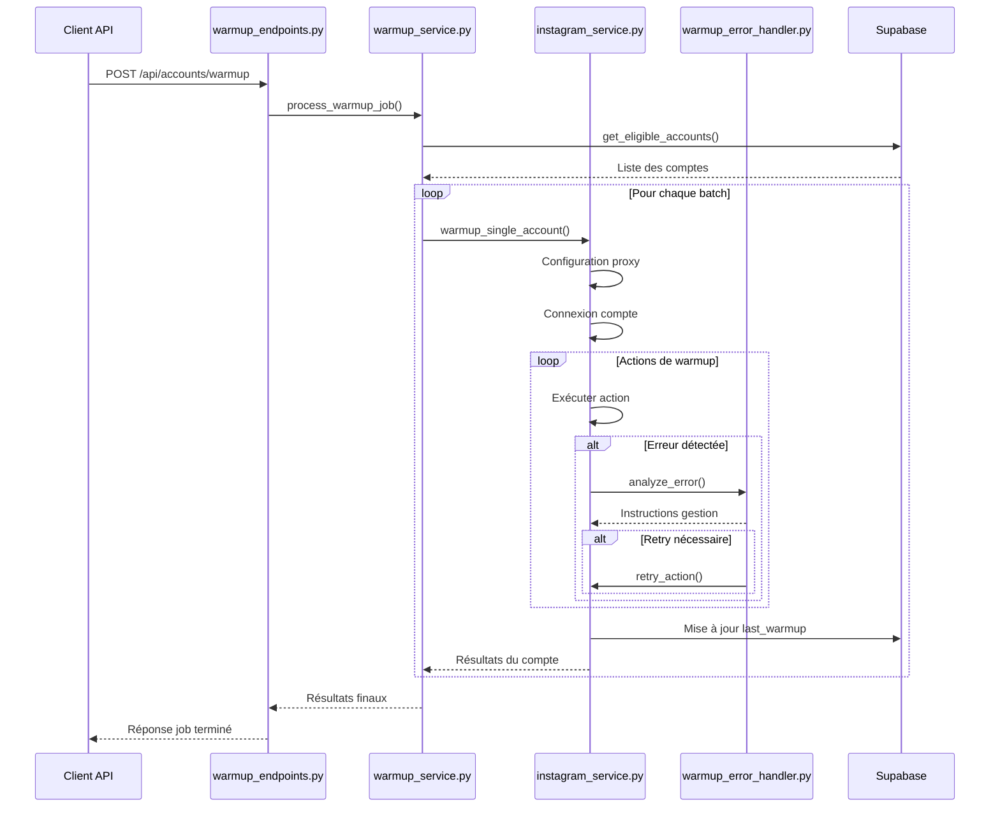
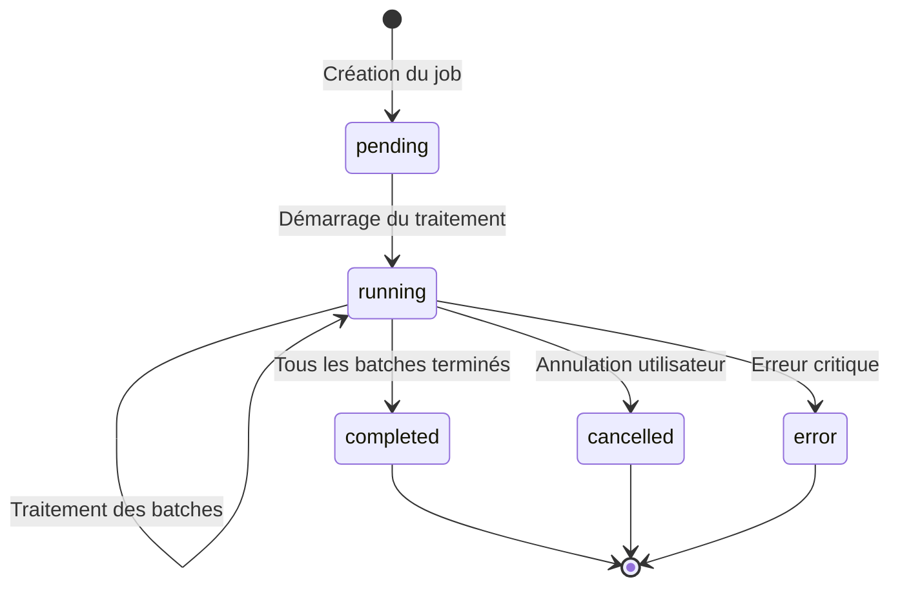

# Documentation Technique - Système de Warmup Automatisé Instagram

## Table des Matières

1. [Vue d'ensemble du système](#1-vue-densemble-du-système)
2. [Architecture et composants](#2-architecture-et-composants)
3. [Fonctionnalités principales](#3-fonctionnalités-principales)
4. [API et endpoints](#4-api-et-endpoints)
5. [Modèles de données](#5-modèles-de-données)
6. [Configuration et paramètres](#6-configuration-et-paramètres)
7. [Gestion d'erreurs robuste](#7-gestion-derreurs-robuste)
8. [Système de jobs et batches](#8-système-de-jobs-et-batches)
9. [Base de données](#9-base-de-données)
10. [Sécurité et bonnes pratiques](#10-sécurité-et-bonnes-pratiques)
11. [Installation et déploiement](#11-installation-et-déploiement)
12. [Exemples d'utilisation](#12-exemples-dutilisation)
13. [Monitoring et logs](#13-monitoring-et-logs)
14. [Dépannage](#14-dépannage)

---

## 1. Vue d'ensemble du système

### 1.1 Objectif

Le système de warmup automatisé Instagram est conçu pour maintenir l'activité des comptes Instagram de manière naturelle et intelligente. Il simule le comportement d'un utilisateur réel en effectuant diverses interactions automatisées tout en évitant la détection par les algorithmes d'Instagram.

### 1.2 Fonctionnement général



### 1.3 Principes clés

- **Comportement naturel** : Délais aléatoires, patterns humains
- **Gestion d'erreurs robuste** : Classification intelligente, retry automatique
- **Sécurité maximale** : Proxies dédiés, limites respectées
- **Scalabilité** : Traitement par batches, jobs asynchrones
- **Monitoring complet** : Logs détaillés, métriques en temps réel

---

## 2. Architecture et composants

### 2.1 Structure des fichiers

```
├── api/
│   └── warmup_endpoints.py          # Endpoints API REST
├── services/
│   ├── warmup_service.py            # Service principal de warmup
│   ├── warmup_error_handler.py      # Gestionnaire d'erreurs robuste
│   ├── warmup_enhanced.py           # Version améliorée (optionnelle)
│   └── instagram_service.py         # Service Instagram (actions)
├── models/
│   └── warmup_models.py             # Modèles Pydantic
├── database/
│   └── warmup_migration.py          # Migration base de données
├── tests/
│   ├── test_warmup_system.py        # Tests système complet
│   ├── test_error_resilience.py     # Tests de résilience
│   └── test_integrated_error_handling.py # Tests d'intégration
└── docs/
    ├── WARMUP_SYSTEM.md             # Documentation utilisateur
    └── WARMUP_TECHNICAL_DOCUMENTATION.md # Cette documentation
```

### 2.2 Composants principaux

#### 2.2.1 WarmupService (`services/warmup_service.py`)
- **Rôle** : Orchestrateur principal du système
- **Responsabilités** :
  - Gestion des jobs asynchrones
  - Traitement par batches
  - Coordination des comptes
  - Suivi des statistiques

#### 2.2.2 WarmupErrorHandler (`services/warmup_error_handler.py`)
- **Rôle** : Gestionnaire d'erreurs intelligent
- **Responsabilités** :
  - Classification des erreurs (8 types, 4 sévérités)
  - Mécanismes de retry automatique
  - Seuils de sécurité
  - Statistiques d'erreurs

#### 2.2.3 InstagramService (`services/instagram_service.py`)
- **Rôle** : Interface avec l'API Instagram
- **Responsabilités** :
  - Connexion aux comptes
  - Exécution des actions (likes, commentaires, follows)
  - Exploration des hashtags et reels
  - Gestion des proxies

### 2.3 Flux de données



---

## 3. Fonctionnalités principales

### 3.1 Types d'interactions

#### 3.1.1 Exploration de hashtags
```python
# Posts classiques (60% du temps)
medias = cl.hashtag_medias_top(hashtag, amount=random.randint(5, 12))
# ou
medias = cl.hashtag_medias_recent(hashtag, amount=random.randint(8, 15))

# Reels (40% du temps)
reels = cl.hashtag_medias_reels_v1(hashtag, amount=random.randint(5, 10))
```

#### 3.1.2 Actions automatisées

| Action | Fréquence | Limites par session | Délais |
|--------|-----------|-------------------|--------|
| **Likes** | 65-70% des posts | 10-20 (randomisé) | 2-10 secondes |
| **Commentaires** | 12-18% des posts | 5-20 (randomisé) | 4-12 secondes |
| **Follows** | 12-15% des auteurs | 1-5 (randomisé) | 6-18 secondes |
| **Timeline check** | 25% de chance | Illimité | 8-20 secondes |

#### 3.1.3 Commentaires intelligents

Le système dispose de plus de 200 variations de commentaires en français et anglais :

```python
COMMENTS = {
    'general': [
        "Super ! 👍", "Magnifique !", "J'adore ! ❤️",
        "Amazing! 🔥", "Love this! 💕", "Incredible! ✨"
    ],
    'fitness': [
        "Motivation ! 💪", "Keep going! 🏋️", "Beast mode! 🔥"
    ],
    'reel': [
        "Excellent reel ! 🎬", "So creative! 🎨", "Love the editing! ✨"
    ]
}
```

### 3.2 Comportement naturel simulé

#### 3.2.1 Délais aléatoires
- **Entre actions** : 2-60 secondes
- **Entre posts** : 3-15 secondes  
- **Entre hashtags** : 15-45 secondes
- **Entre batches** : 30-120 secondes
- **Pauses de navigation** : 20-60 secondes (30% de chance)

#### 3.2.2 Patterns humains
- Variation des durées de session (5-30 minutes)
- Exploration mixte posts/reels
- Détection automatique du type de contenu
- Adaptation des commentaires au contexte

### 3.3 Gestion des proxies

#### 3.3.1 Configuration automatique
```python
# Attribution déterministe par compte
def get_lightning_proxy_for_account(account_id: int) -> Optional[Dict[str, str]]:
    proxy_index = account_id % len(LIGHTNING_PROXIES)
    proxy_string = LIGHTNING_PROXIES[proxy_index]
    return parse_lightning_proxy(proxy_string)
```

#### 3.3.2 Types de proxies
- **Lightning Proxies** : 20 proxies mobiles français (méthode principale)
- **HDC2 Proxies** : Proxies de fallback (ports 7465, 7467)
- **Connexion directe** : En cas d'échec des proxies

---

## 4. API et endpoints

### 4.1 Endpoint principal - Démarrer un warmup

#### `POST /api/accounts/warmup`

**Description** : Démarre un job de warmup automatisé pour les comptes Instagram

**Headers** :
```http
Content-Type: application/json
```

**Body** :
```json
{
  "accounts": [
    {"id": 1, "username": "compte1"},
    {"id": 2, "username": "compte2"},
    {"id": 3, "username": "compte3"}
  ],
  "batch_size": 10
}
```

**Réponse** (200 OK) :
```json
{
  "job_id": "550e8400-e29b-41d4-a716-446655440000",
  "total_accounts": 3,
  "total_batches": 1,
  "estimated_duration_minutes": 15,
  "batch_size": 10,
  "status": "started"
}
```

**Codes d'erreur** :
- `400` : Paramètres invalides (aucun compte spécifié)
- `500` : Erreur interne du serveur

### 4.2 Suivi du statut d'un job

#### `GET /api/accounts/warmup/{job_id}/status`

**Description** : Récupère le statut en temps réel d'un job de warmup

**Paramètres** :
- `job_id` (string) : Identifiant unique du job

**Réponse** (200 OK) :
```json
{
  "job_id": "550e8400-e29b-41d4-a716-446655440000",
  "status": "running",
  "start_time": "2024-01-15T10:30:00Z",
  "end_time": null,
  "current_batch": 2,
  "total_batches": 5,
  "accounts_processed": 20,
  "total_accounts": 45,
  "progress_percentage": 44.4,
  "results": [
    {
      "batch_number": 1,
      "accounts_processed": [
        {
          "account_id": 1,
          "username": "compte1",
          "status": "success",
          "stats": {
            "likes": 45,
            "comments": 8,
            "follows": 2,
            "duration_minutes": 12.5
          },
          "duration_minutes": 12.5
        }
      ],
      "batch_duration_minutes": 15.2,
      "success_count": 8,
      "error_count": 1,
      "banned_count": 1
    }
  ],
  "error": null
}
```

**Statuts possibles** :
- `running` : Job en cours d'exécution
- `completed` : Job terminé avec succès
- `cancelled` : Job annulé par l'utilisateur
- `error` : Job terminé en erreur

### 4.3 Annulation d'un job

#### `POST /api/accounts/warmup/{job_id}/cancel`

**Description** : Annule un job de warmup en cours

**Paramètres** :
- `job_id` (string) : Identifiant unique du job

**Réponse** (200 OK) :
```json
{
  "message": "Job 550e8400-e29b-41d4-a716-446655440000 annulé avec succès",
  "job_id": "550e8400-e29b-41d4-a716-446655440000",
  "status": "cancelled"
}
```

### 4.4 Statistiques générales

#### `GET /api/accounts/warmup/stats`

**Description** : Récupère les statistiques générales des comptes et du warmup

**Réponse** (200 OK) :
```json
{
  "total_accounts": 150,
  "accounts_by_status": {
    "actif": 120,
    "nouveau": 15,
    "erreur": 10,
    "banni": 5
  },
  "recent_warmup_count": 25,
  "eligible_for_warmup": 135
}
```

---

## 5. Modèles de données

### 5.1 Modèles de requête

#### 5.1.1 WarmupRequest
```python
class WarmupRequest(BaseModel):
    accounts: List[AccountSelection] = Field(..., min_items=1, description="Liste des comptes sélectionnés pour le warmup")
    batch_size: int = Field(default=10, ge=1, le=20, description="Nombre de comptes par batch")
```

#### 5.1.2 AccountSelection
```python
class AccountSelection(BaseModel):
    id: int = Field(..., description="Account ID from database")
    username: str = Field(..., description="Instagram username")
```

### 5.2 Modèles de réponse

#### 5.2.1 WarmupResponse
```python
class WarmupResponse(BaseModel):
    job_id: str
    total_accounts: int
    total_batches: int
    estimated_duration_minutes: int
    batch_size: int
    status: str = "started"
```

#### 5.2.2 WarmupJobStatus
```python
class WarmupJobStatus(BaseModel):
    job_id: str
    status: str  # "running", "completed", "cancelled", "error"
    start_time: Optional[str] = None
    end_time: Optional[str] = None
    current_batch: int = 0
    total_batches: int = 0
    accounts_processed: int = 0
    total_accounts: int = 0
    progress_percentage: float = 0.0
    results: List[WarmupBatchResult] = []
    error: Optional[str] = None
```

### 5.3 Modèles de résultats

#### 5.3.1 WarmupAccountResult
```python
class WarmupAccountResult(BaseModel):
    account_id: int
    username: str
    status: str  # "success", "error", "banned", "skipped"
    stats: Optional[Dict[str, int]] = None
    error_message: Optional[str] = None
    duration_minutes: Optional[float] = None
```

#### 5.3.2 WarmupBatchResult
```python
class WarmupBatchResult(BaseModel):
    batch_number: int
    accounts_processed: List[WarmupAccountResult]
    batch_duration_minutes: float
    success_count: int
    error_count: int
    banned_count: int

---

## 6. Configuration et paramètres

### 6.1 Limites de sécurité

#### 6.1.1 Limites par session de warmup
```python
# Configuration dans config.py
WARMUP_LIMITS = {
    "likes_min": 10,      # 10-20 likes par session (réduit pour sécurité)
    "likes_max": 20,
    "comments_min": 5,    # 5-20 commentaires par session
    "comments_max": 20,
    "follows_min": 1,     # 1-5 follows par session
    "follows_max": 5
}
```

#### 6.1.2 Durées de session
```python
# Configuration fixe dans config.py
WARMUP_DURATION = {
    "min_minutes": 5,     # Durée minimum fixe
    "max_minutes": 15     # Durée maximum fixe
}
# Durée réelle = random.randint(5, 15) minutes
```

#### 6.1.3 Délais entre actions
```python
DELAYS = {
    'between_actions': (2, 60),      # 2-60 secondes
    'between_posts': (3, 15),        # 3-15 secondes
    'between_hashtags': (15, 45),    # 15-45 secondes
    'between_batches': (30, 120),    # 30-120 secondes (2 minutes max)
    'navigation_pause': (20, 60)     # 20-60 secondes (30% de chance)
}
```

### 6.2 Hashtags prédéfinis

#### 6.2.1 Configuration des hashtags
```python
# Configuration dans config.py
WARMUP_HASHTAGS = [
    "lifestyle", "fitness", "motivation", "travel", "food",
    "fashion", "art", "nature", "photography", "inspiration"
]

# Sélection automatique
selected_hashtags = random.sample(WARMUP_HASHTAGS, min(3, len(WARMUP_HASHTAGS)))
```

#### 6.2.2 Sélection des comptes
```python
# Les comptes sont maintenant fournis directement dans la requête API
# Plus besoin de filtres automatiques - contrôle total par l'utilisateur
accounts = [
    {"id": 1, "username": "compte1"},
    {"id": 2, "username": "compte2"}
]
```

### 6.3 Configuration des proxies

#### 6.3.1 Lightning Proxies (Principal)
```python
# 20 proxies mobiles français configurés
LIGHTNING_PROXIES = [
    "mob-eu.lightningproxies.net:8000:user-session-country-FR:password",
    # ... 19 autres proxies
]

# Attribution déterministe par compte
proxy_index = account_id % len(LIGHTNING_PROXIES)
```

#### 6.3.2 Configuration de fallback
```python
# Anciens proxies HDC2 (compatibilité)
PROXY_PORTS = [7465, 7467]

# Ordre de priorité :
# 1. Lightning Proxy basé sur account_id
# 2. Lightning Proxy aléatoire
# 3. Proxy HDC2
# 4. Connexion directe (sans proxy)
```

### 6.4 Paramètres de traitement

#### 6.4.1 Batches et concurrence
```python
# Configuration par défaut
DEFAULT_BATCH_SIZE = 10          # Comptes par batch
MAX_CONCURRENT_ACCOUNTS = 5      # Traitement simultané dans un batch
BATCH_PAUSE_MIN = 30            # Pause minimum entre batches (secondes)
BATCH_PAUSE_MAX = 120           # Pause maximum entre batches (secondes)
```

#### 6.4.2 Timeouts et retry
```python
# Timeouts de connexion
CONNECTION_TIMEOUT = 30          # Secondes
LOGIN_TIMEOUT = 60              # Secondes

# Retry de connexion
MAX_LOGIN_RETRIES = 3           # Tentatives de connexion
RETRY_DELAY = 5                 # Délai entre tentatives (secondes)
```

---

## 7. Gestion d'erreurs robuste

### 7.1 Classification des erreurs

#### 7.1.1 Types d'erreurs (ErrorType)
```python
class ErrorType(Enum):
    RATE_LIMIT = "rate_limit"              # Limitation de taux
    NETWORK = "network"                    # Problèmes réseau
    AUTHENTICATION = "authentication"      # Problèmes d'authentification
    PERMISSION = "permission"              # Problèmes de permissions
    CONTENT_NOT_FOUND = "content_not_found" # Contenu non trouvé
    ACCOUNT_RESTRICTED = "account_restricted" # Compte restreint
    CHALLENGE_REQUIRED = "challenge_required" # Challenge de sécurité
    UNKNOWN = "unknown"                    # Erreur inconnue
```

#### 7.1.2 Niveaux de sévérité (ErrorSeverity)
```python
class ErrorSeverity(Enum):
    LOW = "low"           # Erreur mineure, continuer normalement
    MEDIUM = "medium"     # Erreur modérée, retry puis continuer
    HIGH = "high"         # Erreur grave, arrêter l'action mais continuer la session
    CRITICAL = "critical" # Erreur critique, arrêter la session
```

### 7.2 Patterns d'erreurs et gestion

#### 7.2.1 Rate Limiting
```python
"429": ErrorInfo(
    ErrorType.RATE_LIMIT, ErrorSeverity.HIGH,
    "Rate limit atteint",
    retry_after=300,  # 5 minutes
    max_retries=2,
    should_continue_session=True,
    should_continue_action_type=False  # Désactive ce type d'action
)
```

#### 7.2.2 Erreurs critiques
```python
"challenge_required": ErrorInfo(
    ErrorType.CHALLENGE_REQUIRED, ErrorSeverity.CRITICAL,
    "Challenge de vérification requis",
    max_retries=0,
    should_continue_session=False  # Arrêt immédiat
)
```

#### 7.2.3 Erreurs légères
```python
"media not found": ErrorInfo(
    ErrorType.CONTENT_NOT_FOUND, ErrorSeverity.LOW,
    "Contenu non trouvé",
    max_retries=0,
    should_continue_session=True,
    should_continue_action_type=True  # Continue normalement
)
```

### 7.3 Mécanismes de retry

#### 7.3.1 Retry automatique
```python
def _retry_action(self, action_func, error_info, action_type, *args, **kwargs):
    for attempt in range(error_info.max_retries):
        try:
            # Délai avec variation aléatoire
            if error_info.retry_after:
                wait_time = error_info.retry_after + random.uniform(-30, 30)
            else:
                # Délai exponentiel par défaut
                wait_time = (2 ** attempt) * 5 + random.uniform(0, 10)

            time.sleep(wait_time)
            result = action_func(*args, **kwargs)

            # Succès du retry
            self.session_stats['retries_performed'] += 1
            return True, result

        except Exception as retry_error:
            # Log et continue avec la prochaine tentative
            pass

    return False, None  # Tous les retries échoués
```

### 7.4 Seuils de sécurité

#### 7.4.1 Limites par session
```python
class WarmupErrorHandler:
    def __init__(self):
        self.max_errors_per_session = 50      # Maximum 50 erreurs par session
        self.max_consecutive_errors = 10      # Maximum 10 erreurs consécutives
        self.consecutive_error_count = 0
```

#### 7.4.2 Vérification des seuils
```python
def should_continue_session(self) -> bool:
    # Vérifier le nombre total d'erreurs
    if self.session_stats['total_errors'] >= self.max_errors_per_session:
        return False

    # Vérifier les erreurs consécutives
    if self.consecutive_error_count >= self.max_consecutive_errors:
        return False

    return True
```

### 7.5 Statistiques d'erreurs

#### 7.5.1 Métriques trackées
```python
session_stats = {
    'total_errors': 0,                    # Nombre total d'erreurs
    'errors_by_type': {},                 # Erreurs par type (rate_limit, network, etc.)
    'errors_by_action': {},               # Erreurs par action (like, comment, follow)
    'retries_performed': 0,               # Nombre de retries effectués
    'actions_skipped': 0,                 # Actions sautées à cause d'erreurs
    'consecutive_errors': 0,              # Erreurs consécutives actuelles
    'error_rate': 0.0                     # Taux d'erreur en pourcentage
}
```

#### 7.5.2 Exemple de statistiques
```json
{
  "total_errors": 8,
  "errors_by_type": {
    "network": 3,
    "rate_limit": 2,
    "content_not_found": 3
  },
  "errors_by_action": {
    "like": 4,
    "comment": 2,
    "follow": 2
  },
  "retries_performed": 5,
  "actions_skipped": 3,
  "error_rate": 15.7
}
```

---

## 8. Système de jobs et batches

### 8.1 Architecture des jobs

#### 8.1.1 Cycle de vie d'un job


#### 8.1.2 Structure d'un job
```python
job_structure = {
    "job_id": "uuid-string",
    "status": "running",                    # pending, running, completed, cancelled, error
    "start_time": "2024-01-15T10:30:00Z",
    "end_time": None,
    "current_batch": 2,
    "total_batches": 5,
    "accounts_processed": 20,
    "total_accounts": 45,
    "progress_percentage": 44.4,
    "results": [],                          # Liste des WarmupBatchResult
    "error": None
}
```

### 8.2 Traitement par batches

#### 8.2.1 Logique de batching
```python
def create_batches(accounts: List[Dict], batch_size: int) -> List[List[Dict]]:
    """Divise les comptes en batches de taille fixe"""
    batches = []
    for i in range(0, len(accounts), batch_size):
        batch = accounts[i:i + batch_size]
        batches.append(batch)
    return batches

# Exemple : 45 comptes avec batch_size=10
# Résultat : 5 batches [10, 10, 10, 10, 5]
```

#### 8.2.2 Traitement séquentiel des batches
```python
async def process_warmup_job(self, job_id, hashtags, batch_size, duration_min, duration_max, account_filters):
    accounts = self.get_eligible_accounts(account_filters)
    batches = self.create_batches(accounts, batch_size)

    for batch_number, batch_accounts in enumerate(batches, 1):
        # Traitement parallèle des comptes dans le batch
        batch_results = await self.process_batch_parallel(
            batch_accounts, hashtags, duration_min, duration_max, job_id
        )

        # Pause entre les batches
        if batch_number < len(batches):
            pause_duration = random.uniform(30, 120)  # 30-120 secondes
            await asyncio.sleep(pause_duration)
```

### 8.3 Traitement asynchrone

#### 8.3.1 Gestion des tâches en arrière-plan
```python
# Dans l'endpoint API
background_tasks.add_task(
    warmup_service.process_warmup_job,
    job_id=job_id,
    hashtags=request.hashtags,
    batch_size=request.batch_size,
    duration_min=request.warmup_duration_min,
    duration_max=request.warmup_duration_max,
    account_filters=request.account_filters
)
```

#### 8.3.2 Stockage des jobs actifs
```python
class WarmupService:
    def __init__(self):
        self._active_jobs: Dict[str, Dict] = {}
        self._job_lock = threading.Lock()

    def get_job_status(self, job_id: str) -> Optional[Dict]:
        with self._job_lock:
            return self._active_jobs.get(job_id)
```

### 8.4 Suivi en temps réel

#### 8.4.1 Mise à jour du statut
```python
def update_job_progress(self, job_id: str, batch_number: int, accounts_processed: int):
    with self._job_lock:
        if job_id in self._active_jobs:
            job = self._active_jobs[job_id]
            job["current_batch"] = batch_number
            job["accounts_processed"] = accounts_processed
            job["progress_percentage"] = (accounts_processed / job["total_accounts"]) * 100
```

#### 8.4.2 Endpoint de suivi
```python
@warmup_router.get("/warmup/{job_id}/status")
async def get_warmup_job_status(job_id: str):
    status = warmup_service.get_job_status(job_id)
    if not status:
        raise HTTPException(status_code=404, detail="Job non trouvé")
    return status
```

### 8.5 Annulation de jobs

#### 8.5.1 Mécanisme d'annulation
```python
def cancel_job(self, job_id: str) -> bool:
    with self._job_lock:
        if job_id in self._active_jobs:
            self._active_jobs[job_id]["status"] = "cancelled"
            return True
    return False

# Vérification dans la boucle de traitement
def should_continue_job(self, job_id: str) -> bool:
    job = self.get_job_status(job_id)
    return job and job.get("status") == "running"
```

#### 8.5.2 Endpoint d'annulation
```python
@warmup_router.post("/warmup/{job_id}/cancel")
async def cancel_warmup_job(job_id: str):
    success = warmup_service.cancel_job(job_id)
    if not success:
        raise HTTPException(status_code=404, detail="Job non trouvé ou déjà terminé")

    return {
        "message": f"Job {job_id} annulé avec succès",
        "job_id": job_id,
        "status": "cancelled"
    }

---

## 9. Base de données

### 9.1 Champs utilisés

#### 9.1.1 Table `instagram_accounts`
```sql
-- Champs existants
id INTEGER PRIMARY KEY
username VARCHAR
password VARCHAR
email VARCHAR
statut VARCHAR  -- 'actif', 'nouveau', 'erreur', 'banni'
model_id INTEGER
created_at TIMESTAMP
updated_at TIMESTAMP

-- Champs ajoutés pour le warmup
last_warmup TIMESTAMP        -- Date du dernier warmup (ISO 8601)
warmup_stats JSONB          -- Statistiques détaillées du dernier warmup
```

#### 9.1.2 Structure de `warmup_stats`
```json
{
  "timeline_checks": 3,
  "likes": 45,
  "comments": 8,
  "follows": 2,
  "hashtag_explorations": 6,
  "reels_interactions": 12,
  "posts_interactions": 33,
  "successful_actions": 53,
  "failed_actions": 2,
  "duration_minutes": 12.5,
  "error_stats": {
    "total_errors": 2,
    "errors_by_type": {"network": 1, "content_not_found": 1},
    "errors_by_action": {"like": 1, "comment": 1},
    "retries_performed": 1,
    "actions_skipped": 1,
    "error_rate": 3.6
  },
  "session_completed": true,
  "limits_reached": {
    "likes": false,
    "comments": false,
    "follows": false
  }
}
```

### 9.2 Migration nécessaire

#### 9.2.1 Script de migration SQL
```sql
-- Ajouter les colonnes de warmup
ALTER TABLE instagram_accounts
ADD COLUMN IF NOT EXISTS last_warmup TIMESTAMP;

ALTER TABLE instagram_accounts
ADD COLUMN IF NOT EXISTS warmup_stats JSONB;

-- Créer les index pour les performances
CREATE INDEX IF NOT EXISTS idx_instagram_accounts_warmup
ON instagram_accounts(statut, last_warmup);

CREATE INDEX IF NOT EXISTS idx_instagram_accounts_last_warmup
ON instagram_accounts(last_warmup);

-- Index pour les requêtes de filtrage
CREATE INDEX IF NOT EXISTS idx_instagram_accounts_model_warmup
ON instagram_accounts(model_id, statut, last_warmup);
```

#### 9.2.2 Exécution de la migration
```bash
# Via le script Python
python database/warmup_migration.py

# Ou directement dans Supabase SQL Editor
-- Copier-coller les commandes SQL ci-dessus
```

### 9.3 Requêtes de sélection

#### 9.3.1 Comptes éligibles pour warmup
```sql
-- Requête générée par get_eligible_accounts()
SELECT * FROM instagram_accounts
WHERE statut IN ('actif', 'nouveau')
AND (
    last_warmup IS NULL
    OR last_warmup < '2024-01-15T10:00:00'  -- Cutoff time (24h ago)
)
AND (model_id = 123 OR model_id IS NULL)  -- Si model_id spécifié
ORDER BY updated_at ASC
LIMIT 100;  -- Limite optionnelle
```

#### 9.3.2 Statistiques de warmup
```sql
-- Comptes par statut
SELECT statut, COUNT(*) as count
FROM instagram_accounts
GROUP BY statut;

-- Comptes avec warmup récent (24h)
SELECT COUNT(*) as recent_warmup_count
FROM instagram_accounts
WHERE last_warmup >= '2024-01-15T10:00:00';

-- Comptes éligibles
SELECT COUNT(*) as eligible_count
FROM instagram_accounts
WHERE statut IN ('actif', 'nouveau')
AND (last_warmup IS NULL OR last_warmup < '2024-01-15T10:00:00');
```

### 9.4 Mise à jour après warmup

#### 9.4.1 Mise à jour réussie
```python
# Dans warmup_single_account() après succès
db_manager.update_account(account_id, {
    "last_warmup": datetime.now().isoformat(),  # Format ISO 8601
    "warmup_stats": stats,                      # Statistiques complètes
    "statut": "actif"                          # Confirmer le statut actif
})
```

#### 9.4.2 Mise à jour en cas d'erreur
```python
# En cas d'erreur critique
if "challenge_required" in error_msg.lower():
    new_status = "banni"
elif "429" in error_msg or "too many" in error_msg.lower():
    new_status = "erreur"
else:
    new_status = "erreur"

# Mise à jour sans last_warmup (échec)
db_manager.update_account(account_id, {"statut": new_status})
```

---

## 10. Sécurité et bonnes pratiques

### 10.1 Utilisation des proxies

#### 10.1.1 Attribution déterministe
```python
# Chaque compte utilise toujours le même proxy
def get_lightning_proxy_for_account(account_id: int):
    proxy_index = account_id % len(LIGHTNING_PROXIES)
    return LIGHTNING_PROXIES[proxy_index]

# Avantages :
# - Géolocalisation stable
# - Évite les changements d'IP suspects
# - Répartition équilibrée de la charge
```

#### 10.1.2 Proxies mobiles français
```python
# Configuration Lightning Proxies
LIGHTNING_PROXIES = [
    "mob-eu.lightningproxies.net:8000:user-country-FR-session-xxx:password"
]

# Caractéristiques :
# - Proxies mobiles (plus naturels)
# - Géolocalisation française
# - Sessions dédiées
# - Rotation automatique des IP
```

### 10.2 Évitement de la détection

#### 10.2.1 Patterns humains
```python
# Délais aléatoires entre toutes les actions
time.sleep(random.uniform(2, 60))

# Variation des durées de session
warmup_duration = random.randint(duration_min, duration_max)

# Pauses de navigation réalistes
if random.random() < 0.3:  # 30% de chance
    pause_duration = random.uniform(20, 60)
    time.sleep(pause_duration)
```

#### 10.2.2 Limites respectées
```python
# Limites par session (randomisées)
max_likes = random.randint(30, 80)      # Instagram limite ~100/heure
max_comments = random.randint(5, 20)    # Instagram limite ~30/heure
max_follows = random.randint(1, 5)      # Instagram limite ~20/heure

# Espacement minimum entre sessions
recent_warmup_hours = 24  # Minimum 24h entre warmups
```

#### 10.2.3 Comportement naturel
```python
# Exploration mixte posts/reels
explore_reels = random.random() < 0.4  # 40% reels, 60% posts

# Commentaires adaptatifs au contenu
comment_type = _detect_content_type(media)  # fitness, lifestyle, general, reel
comment = _get_random_comment(comment_type)

# Vérification du timeline (action naturelle)
if random.random() < 0.25:  # 25% de chance
    cl.get_timeline_feed()
```

### 10.3 Limites Instagram

#### 10.3.1 Limites officielles (approximatives)
| Action | Limite horaire | Limite quotidienne | Recommandation système |
|--------|----------------|-------------------|----------------------|
| **Likes** | ~100 | ~1000 | 10-20 par session |
| **Commentaires** | ~30 | ~200 | 5-20 par session |
| **Follows** | ~20 | ~150 | 1-5 par session |
| **Unfollows** | ~20 | ~150 | Non implémenté |

#### 10.3.2 Signaux de détection à éviter
```python
# ❌ Patterns à éviter
# - Actions trop rapides (< 2 secondes)
# - Commentaires identiques répétés
# - Follows massifs en peu de temps
# - Activité 24h/24 sans pause
# - Changements d'IP fréquents

# ✅ Bonnes pratiques implémentées
# - Délais aléatoires variables
# - +200 variations de commentaires
# - Limites conservatrices
# - Pauses de navigation
# - Proxies stables par compte
```

### 10.4 Monitoring de sécurité

#### 10.4.1 Indicateurs d'alerte
```python
# Taux d'erreur élevé
if error_rate > 20:  # Plus de 20% d'erreurs
    logger.warning("Taux d'erreur élevé détecté")

# Comptes bannis fréquents
if banned_count > total_accounts * 0.1:  # Plus de 10% de bannis
    logger.error("Taux de bannissement élevé")

# Rate limits fréquents
if rate_limit_errors > 5:  # Plus de 5 rate limits
    logger.warning("Rate limits fréquents détectés")
```

#### 10.4.2 Actions préventives
```python
# Réduction automatique des limites
if error_rate > 15:
    max_likes = int(max_likes * 0.8)  # Réduire de 20%
    max_comments = int(max_comments * 0.8)
    max_follows = int(max_follows * 0.8)

# Augmentation des délais
if rate_limit_detected:
    base_delay *= 1.5  # Augmenter les délais de 50%

# Pause forcée
if consecutive_errors > 5:
    time.sleep(300)  # Pause de 5 minutes
```

---

## 11. Installation et déploiement

### 11.1 Prérequis

#### 11.1.1 Dépendances Python
```bash
# Dépendances principales
pip install fastapi uvicorn
pip install instagrapi
pip install supabase
pip install pydantic
pip install python-multipart

# Dépendances pour les tests
pip install pytest pytest-asyncio
pip install requests
```

#### 11.1.2 Configuration de l'environnement
```bash
# Variables d'environnement requises
export SUPABASE_URL="https://your-project.supabase.co"
export SUPABASE_KEY="your-anon-key"
export SUPABASE_SERVICE_KEY="your-service-key"

# Configuration optionnelle
export WARMUP_LOG_LEVEL="INFO"
export WARMUP_MAX_CONCURRENT="5"
export WARMUP_DEFAULT_BATCH_SIZE="10"
```

### 11.2 Configuration

#### 11.2.1 Configuration des proxies
```python
# Dans config.py
LIGHTNING_PROXIES = [
    "mob-eu.lightningproxies.net:8000:user:password",
    # Ajouter vos proxies Lightning
]

# Proxies de fallback (optionnel)
PROXY_PORTS = [7465, 7467]  # Ports HDC2
```

#### 11.2.2 Configuration de la base de données
```python
# Dans database/database.py
SUPABASE_URL = os.getenv("SUPABASE_URL")
SUPABASE_KEY = os.getenv("SUPABASE_KEY")

# Vérifier la connexion
db_manager = DatabaseManager()
if db_manager.test_connection():
    print("✅ Connexion Supabase OK")
else:
    print("❌ Erreur de connexion Supabase")
```

### 11.3 Migration de la base de données

#### 11.3.1 Exécution automatique
```bash
# Script de migration Python
python database/warmup_migration.py

# Sortie attendue :
# Migration des colonnes de warmup
# ========================================
# Commandes SQL à exécuter dans Supabase:
# ==================================================
# -- Commande 1
# ALTER TABLE instagram_accounts
# ADD COLUMN IF NOT EXISTS last_warmup TIMESTAMP;
# ...
```

#### 11.3.2 Exécution manuelle
```sql
-- Dans Supabase SQL Editor
ALTER TABLE instagram_accounts
ADD COLUMN IF NOT EXISTS last_warmup TIMESTAMP,
ADD COLUMN IF NOT EXISTS warmup_stats JSONB;

CREATE INDEX IF NOT EXISTS idx_instagram_accounts_warmup
ON instagram_accounts(statut, last_warmup);
```

### 11.4 Tests

#### 11.4.1 Tests d'intégration
```bash
# Test complet du système
python tests/test_warmup_system.py

# Test de résilience aux erreurs
python tests/test_error_resilience.py

# Test d'intégration avec gestion d'erreurs
python tests/test_integrated_error_handling.py
```

#### 11.4.2 Validation des imports
```bash
# Test des imports et de la configuration
python test_warmup_import.py

# Sortie attendue :
# 🧪 Test des imports du système de warmup
# ==================================================
# 1. Import des modèles warmup...
#    ✅ Modèles importés avec succès
# 2. Import du service warmup...
#    ✅ Service warmup importé avec succès
# ...
```

### 11.5 Démarrage du serveur

#### 11.5.1 Mode développement
```bash
# Démarrage avec rechargement automatique
python main.py

# Ou avec uvicorn directement
uvicorn main:app --host 0.0.0.0 --port 7001 --reload
```

#### 11.5.2 Mode production
```bash
# Démarrage en production
uvicorn main:app --host 0.0.0.0 --port 7001 --workers 4

# Avec gunicorn (recommandé)
gunicorn main:app -w 4 -k uvicorn.workers.UvicornWorker --bind 0.0.0.0:7001
```

#### 11.5.3 Vérification du déploiement
```bash
# Test de santé de l'API
curl http://localhost:7001/api/health

# Test des endpoints warmup
curl http://localhost:7001/api/accounts/warmup/stats

# Réponse attendue :
# {
#   "total_accounts": 150,
#   "accounts_by_status": {...},
#   "recent_warmup_count": 25,
#   "eligible_for_warmup": 135
# }

---

## 12. Exemples d'utilisation

### 12.1 Cas d'usage basique

#### 12.1.1 Warmup simple avec comptes spécifiés
```bash
curl -X POST "http://localhost:7001/api/accounts/warmup" \
  -H "Content-Type: application/json" \
  -d '{
    "accounts": [
      {"id": 1, "username": "compte1"},
      {"id": 2, "username": "compte2"},
      {"id": 3, "username": "compte3"}
    ],
    "batch_size": 5
  }'
```

**Réponse** :
```json
{
  "job_id": "550e8400-e29b-41d4-a716-446655440000",
  "total_accounts": 3,
  "total_batches": 1,
  "estimated_duration_minutes": 15,
  "batch_size": 5,
  "status": "started"
}
```

#### 12.1.2 Suivi du job
```bash
# Vérifier le statut toutes les 30 secondes
watch -n 30 'curl -s http://localhost:7001/api/accounts/warmup/550e8400-e29b-41d4-a716-446655440000/status | jq'
```

### 12.2 Cas d'usage avancé

#### 12.2.1 Warmup avec sélection de comptes spécifiques
```python
import requests

# Configuration avec comptes spécifiés
warmup_request = {
    "accounts": [
        {"id": 1, "username": "compte1"},
        {"id": 5, "username": "compte5"},
        {"id": 12, "username": "compte12"},
        {"id": 18, "username": "compte18"}
    ],
    "batch_size": 2  # Traiter 2 comptes par batch
}

response = requests.post(
    "http://localhost:7001/api/accounts/warmup",
    json=warmup_request
)

if response.status_code == 200:
    job_info = response.json()
    print(f"Job créé: {job_info['job_id']}")
    print(f"Comptes à traiter: {job_info['total_accounts']}")
    print(f"Durée estimée: {job_info['estimated_duration_minutes']} minutes")
else:
    print(f"Erreur: {response.status_code} - {response.text}")
```

#### 12.2.2 Monitoring automatique
```python
import time
import requests

def monitor_warmup_job(job_id: str, check_interval: int = 30):
    """Surveille un job de warmup jusqu'à sa completion"""

    while True:
        try:
            response = requests.get(f"http://localhost:7001/api/accounts/warmup/{job_id}/status")

            if response.status_code == 200:
                status = response.json()

                print(f"Status: {status['status']}")
                print(f"Progression: {status['progress_percentage']:.1f}%")
                print(f"Batch: {status['current_batch']}/{status['total_batches']}")
                print(f"Comptes traités: {status['accounts_processed']}/{status['total_accounts']}")

                if status['status'] in ['completed', 'cancelled', 'error']:
                    print(f"Job terminé avec le statut: {status['status']}")

                    if status['status'] == 'completed':
                        # Afficher les résultats finaux
                        for batch_result in status['results']:
                            print(f"Batch {batch_result['batch_number']}: "
                                  f"{batch_result['success_count']} succès, "
                                  f"{batch_result['error_count']} erreurs")
                    break

                time.sleep(check_interval)
            else:
                print(f"Erreur lors de la vérification: {response.status_code}")
                break

        except Exception as e:
            print(f"Erreur: {e}")
            break

# Utilisation
job_id = "550e8400-e29b-41d4-a716-446655440000"
monitor_warmup_job(job_id)
```

### 12.3 Intégration dans une application

#### 12.3.1 Classe wrapper Python
```python
import requests
from typing import List, Dict, Optional
from datetime import datetime

class WarmupClient:
    """Client Python pour l'API de warmup"""

    def __init__(self, base_url: str = "http://localhost:7001"):
        self.base_url = base_url
        self.session = requests.Session()

    def start_warmup(
        self,
        accounts: List[Dict[str, Any]],
        batch_size: int = 10
    ) -> Dict:
        """Démarre un job de warmup"""

        payload = {
            "accounts": accounts,
            "batch_size": batch_size
        }

        response = self.session.post(
            f"{self.base_url}/api/accounts/warmup",
            json=payload
        )
        response.raise_for_status()
        return response.json()

    def get_job_status(self, job_id: str) -> Dict:
        """Récupère le statut d'un job"""
        response = self.session.get(
            f"{self.base_url}/api/accounts/warmup/{job_id}/status"
        )
        response.raise_for_status()
        return response.json()

    def cancel_job(self, job_id: str) -> Dict:
        """Annule un job"""
        response = self.session.post(
            f"{self.base_url}/api/accounts/warmup/{job_id}/cancel"
        )
        response.raise_for_status()
        return response.json()

    def get_stats(self) -> Dict:
        """Récupère les statistiques générales"""
        response = self.session.get(
            f"{self.base_url}/api/accounts/warmup/stats"
        )
        response.raise_for_status()
        return response.json()

    def wait_for_completion(self, job_id: str, timeout: int = 3600) -> Dict:
        """Attend la completion d'un job (avec timeout)"""
        start_time = datetime.now()

        while (datetime.now() - start_time).seconds < timeout:
            status = self.get_job_status(job_id)

            if status['status'] in ['completed', 'cancelled', 'error']:
                return status

            time.sleep(30)  # Vérifier toutes les 30 secondes

        raise TimeoutError(f"Job {job_id} n'a pas terminé dans les {timeout} secondes")

# Exemple d'utilisation
client = WarmupClient()

# Démarrer un warmup
job = client.start_warmup(
    accounts=[
        {"id": 1, "username": "compte1"},
        {"id": 2, "username": "compte2"}
    ],
    batch_size=5
)

print(f"Job démarré: {job['job_id']}")

# Attendre la completion
final_status = client.wait_for_completion(job['job_id'])
print(f"Job terminé: {final_status['status']}")
```

### 12.4 Automatisation avec cron

#### 12.4.1 Script de warmup quotidien
```bash
#!/bin/bash
# warmup_daily.sh - Script de warmup quotidien

API_URL="http://localhost:7001"
LOG_FILE="/var/log/warmup_daily.log"

echo "$(date): Début du warmup quotidien" >> $LOG_FILE

# Vérifier que l'API est accessible
if ! curl -s "$API_URL/api/health" > /dev/null; then
    echo "$(date): ERREUR - API non accessible" >> $LOG_FILE
    exit 1
fi

# Démarrer le warmup
JOB_RESPONSE=$(curl -s -X POST "$API_URL/api/accounts/warmup" \
  -H "Content-Type: application/json" \
  -d '{
    "accounts": [
      {"id": 1, "username": "compte1"},
      {"id": 2, "username": "compte2"},
      {"id": 3, "username": "compte3"}
    ],
    "batch_size": 10
  }')

# Extraire le job_id
JOB_ID=$(echo $JOB_RESPONSE | jq -r '.job_id')

if [ "$JOB_ID" = "null" ]; then
    echo "$(date): ERREUR - Impossible de démarrer le job" >> $LOG_FILE
    echo "Réponse: $JOB_RESPONSE" >> $LOG_FILE
    exit 1
fi

echo "$(date): Job démarré avec l'ID: $JOB_ID" >> $LOG_FILE

# Surveiller le job (maximum 4 heures)
MAX_WAIT=14400  # 4 heures en secondes
ELAPSED=0
CHECK_INTERVAL=300  # 5 minutes

while [ $ELAPSED -lt $MAX_WAIT ]; do
    STATUS_RESPONSE=$(curl -s "$API_URL/api/accounts/warmup/$JOB_ID/status")
    STATUS=$(echo $STATUS_RESPONSE | jq -r '.status')
    PROGRESS=$(echo $STATUS_RESPONSE | jq -r '.progress_percentage')

    echo "$(date): Status: $STATUS, Progression: $PROGRESS%" >> $LOG_FILE

    if [ "$STATUS" = "completed" ]; then
        echo "$(date): Job terminé avec succès" >> $LOG_FILE

        # Extraire les statistiques finales
        SUCCESS_COUNT=$(echo $STATUS_RESPONSE | jq '[.results[].success_count] | add')
        ERROR_COUNT=$(echo $STATUS_RESPONSE | jq '[.results[].error_count] | add')

        echo "$(date): Résultats - Succès: $SUCCESS_COUNT, Erreurs: $ERROR_COUNT" >> $LOG_FILE
        exit 0
    elif [ "$STATUS" = "error" ] || [ "$STATUS" = "cancelled" ]; then
        echo "$(date): Job terminé en erreur: $STATUS" >> $LOG_FILE
        exit 1
    fi

    sleep $CHECK_INTERVAL
    ELAPSED=$((ELAPSED + CHECK_INTERVAL))
done

echo "$(date): TIMEOUT - Job non terminé après 4 heures" >> $LOG_FILE
exit 1
```

#### 12.4.2 Configuration crontab
```bash
# Éditer le crontab
crontab -e

# Ajouter une ligne pour exécuter le warmup tous les jours à 2h du matin
0 2 * * * /path/to/warmup_daily.sh

# Ou plusieurs fois par jour (toutes les 8 heures)
0 2,10,18 * * * /path/to/warmup_daily.sh
```

---

## 13. Monitoring et logs

### 13.1 Métriques trackées

#### 13.1.1 Métriques par session
```python
session_metrics = {
    # Actions effectuées
    "timeline_checks": 3,
    "likes": 45,
    "comments": 8,
    "follows": 2,
    "hashtag_explorations": 6,
    "reels_interactions": 12,
    "posts_interactions": 33,

    # Performance
    "successful_actions": 53,
    "failed_actions": 2,
    "duration_minutes": 12.5,
    "actions_per_minute": 4.4,

    # Limites
    "limits_reached": {
        "likes": False,
        "comments": False,
        "follows": False
    }
}
```

#### 13.1.2 Métriques d'erreurs
```python
error_metrics = {
    "total_errors": 8,
    "error_rate": 13.1,  # Pourcentage
    "errors_by_type": {
        "network": 3,
        "rate_limit": 2,
        "content_not_found": 3
    },
    "errors_by_action": {
        "like": 4,
        "comment": 2,
        "follow": 2
    },
    "retries_performed": 5,
    "actions_skipped": 3,
    "consecutive_errors": 0
}
```

#### 13.1.3 Métriques de job
```python
job_metrics = {
    "job_id": "uuid-string",
    "total_accounts": 45,
    "accounts_processed": 45,
    "success_count": 38,
    "error_count": 5,
    "banned_count": 2,
    "total_duration_minutes": 180.5,
    "average_duration_per_account": 4.0,
    "batches_completed": 5,
    "batch_success_rate": 84.4
}
```

### 13.2 Logs détaillés

#### 13.2.1 Structure des logs
```python
# Configuration du logging
import logging

logging.basicConfig(
    level=logging.INFO,
    format='%(asctime)s - %(name)s - %(levelname)s - %(message)s',
    handlers=[
        logging.FileHandler('/var/log/warmup.log'),
        logging.StreamHandler()
    ]
)

logger = logging.getLogger('warmup')
```

#### 13.2.2 Exemples de logs
```
2024-01-15 10:30:15 - warmup - INFO - [job-123] Job de warmup démarré pour 45 comptes
2024-01-15 10:30:16 - warmup - INFO - [job-123] Batch 1/5 démarré avec 10 comptes
2024-01-15 10:30:17 - warmup - INFO - [job-123] Début du warmup pour compte1
2024-01-15 10:30:18 - warmup - INFO - [job-123] Proxy Lightning configuré pour compte1: mob-eu.lightningproxies.net:8000
2024-01-15 10:30:25 - warmup - INFO - [job-123] Warmup de compte1 pendant 12 minutes
2024-01-15 10:30:26 - warmup - INFO - [job-123] Exploration du hashtag: #fitness
2024-01-15 10:30:30 - warmup - INFO - [job-123] Post liké: 1234567890
2024-01-15 10:30:35 - warmup - INFO - [job-123] Commentaire ajouté: Super ! 👍
2024-01-15 10:30:40 - warmup - WARNING - [job-123] Erreur lors de l'interaction: Media not found
2024-01-15 10:30:45 - warmup - INFO - [job-123] Utilisateur suivi: target_user
2024-01-15 10:42:30 - warmup - INFO - [job-123] Warmup terminé en 12.1 minutes
2024-01-15 10:42:31 - warmup - INFO - [job-123] Actions réussies: 53, Actions échouées: 2
2024-01-15 10:42:32 - warmup - INFO - [job-123] Warmup réussi pour compte1: {'likes': 45, 'comments': 8, 'follows': 2}
```

### 13.3 Debugging

#### 13.3.1 Mode debug
```python
# Activer le mode debug
import logging
logging.getLogger('warmup').setLevel(logging.DEBUG)

# Logs debug supplémentaires
logger.debug(f"Proxy sélectionné: {proxy_info}")
logger.debug(f"Hashtag exploré: {hashtag}, Posts trouvés: {len(medias)}")
logger.debug(f"Action tentée: {action_type}, Résultat: {result}")
logger.debug(f"Délai appliqué: {delay_seconds}s")
```

#### 13.3.2 Outils de debugging
```python
# Fonction d'inspection des erreurs
def debug_error_analysis(error_handler: WarmupErrorHandler):
    stats = error_handler.get_session_stats()

    print("=== ANALYSE DES ERREURS ===")
    print(f"Total erreurs: {stats['total_errors']}")
    print(f"Taux d'erreur: {stats.get('error_rate', 0):.1f}%")
    print(f"Erreurs consécutives: {stats['consecutive_errors']}")

    print("\nErreurs par type:")
    for error_type, count in stats['errors_by_type'].items():
        print(f"  {error_type}: {count}")

    print("\nErreurs par action:")
    for action, count in stats['errors_by_action'].items():
        print(f"  {action}: {count}")

    print(f"\nRetries effectués: {stats['retries_performed']}")
    print(f"Actions sautées: {stats['actions_skipped']}")

# Fonction de diagnostic de compte
def diagnose_account_issues(account_id: int):
    account = db_manager.get_account_by_id(account_id)

    print(f"=== DIAGNOSTIC COMPTE {account_id} ===")
    print(f"Username: {account.get('username')}")
    print(f"Statut: {account.get('statut')}")
    print(f"Dernier warmup: {account.get('last_warmup')}")

    if account.get('warmup_stats'):
        stats = account['warmup_stats']
        print(f"Dernière session:")
        print(f"  Durée: {stats.get('duration_minutes', 0):.1f} min")
        print(f"  Actions réussies: {stats.get('successful_actions', 0)}")
        print(f"  Actions échouées: {stats.get('failed_actions', 0)}")

        error_stats = stats.get('error_stats', {})
        if error_stats.get('total_errors', 0) > 0:
            print(f"  Erreurs: {error_stats['total_errors']}")
            print(f"  Types d'erreurs: {error_stats.get('errors_by_type', {})}")
```

### 13.4 Performance

#### 13.4.1 Métriques de performance
```python
# Calcul des métriques de performance
def calculate_performance_metrics(job_results: Dict) -> Dict:
    total_accounts = job_results['total_accounts']
    total_duration = job_results['total_duration_minutes']
    success_count = job_results['success_count']

    return {
        "accounts_per_hour": (total_accounts / total_duration) * 60,
        "success_rate": (success_count / total_accounts) * 100,
        "average_duration_per_account": total_duration / total_accounts,
        "throughput_score": (success_count / total_duration) * 60,
        "efficiency_rating": "excellent" if success_count/total_accounts > 0.9 else "good" if success_count/total_accounts > 0.8 else "needs_improvement"
    }
```

#### 13.4.2 Optimisation des performances
```python
# Ajustement automatique des paramètres
def optimize_batch_size(recent_performance: List[Dict]) -> int:
    """Optimise la taille des batches basée sur les performances récentes"""

    if not recent_performance:
        return 10  # Valeur par défaut

    avg_success_rate = sum(p['success_rate'] for p in recent_performance) / len(recent_performance)
    avg_duration = sum(p['avg_duration_per_account'] for p in recent_performance) / len(recent_performance)

    # Si taux de succès élevé et durée raisonnable, augmenter la taille
    if avg_success_rate > 90 and avg_duration < 15:
        return min(15, 10 + 2)  # Augmenter mais plafonner à 15

    # Si taux de succès faible, réduire la taille
    elif avg_success_rate < 80:
        return max(5, 10 - 2)   # Réduire mais minimum 5

    return 10  # Garder la valeur par défaut

---

## 14. Dépannage

### 14.1 Erreurs communes et solutions

#### 14.1.1 "Aucun compte éligible trouvé"

**Symptôme** :
```json
{
  "status_code": 404,
  "detail": "Aucun compte éligible trouvé avec les critères spécifiés"
}
```

**Causes possibles** :
1. Tous les comptes ont été warmup récemment (< 24h)
2. Aucun compte avec le statut "actif" ou "nouveau"
3. Filtrage trop restrictif par model_id

**Solutions** :
```bash
# 1. Vérifier les statistiques générales
curl http://localhost:7001/api/accounts/warmup/stats

# 2. Ajuster les filtres
{
  "account_filters": {
    "statut": ["actif", "nouveau", "erreur"],  # Inclure plus de statuts
    "exclude_recent_warmup": false,            # Désactiver l'exclusion
    "recent_warmup_hours": 12                  # Réduire la période d'exclusion
  }
}

# 3. Vérifier la base de données
SELECT statut, COUNT(*) FROM instagram_accounts GROUP BY statut;
SELECT COUNT(*) FROM instagram_accounts WHERE last_warmup > NOW() - INTERVAL '24 hours';
```

#### 14.1.2 "Challenge required" fréquent

**Symptôme** :
```
2024-01-15 10:30:40 - warmup - ERROR - [job-123] Erreur critique détectée: Challenge de vérification requis
```

**Causes possibles** :
1. Comptes détectés comme suspects par Instagram
2. Activité trop intensive
3. Proxies de mauvaise qualité

**Solutions** :
```python
# 1. Réduire les limites d'actions
max_likes = random.randint(20, 50)      # Au lieu de 30-80
max_comments = random.randint(3, 10)    # Au lieu de 5-20
max_follows = random.randint(1, 3)      # Au lieu de 1-5

# 2. Augmenter les délais
time.sleep(random.uniform(5, 120))      # Au lieu de 2-60

# 3. Espacer davantage les sessions
recent_warmup_hours = 48                # Au lieu de 24

# 4. Vérifier les proxies
def test_proxy_quality(proxy_url):
    try:
        response = requests.get("https://httpbin.org/ip", proxies={"https": proxy_url}, timeout=10)
        return response.status_code == 200
    except:
        return False
```

#### 14.1.3 Rate limit (429) fréquent

**Symptôme** :
```
2024-01-15 10:30:40 - warmup - WARNING - Erreur like: Rate limit atteint (Sévérité: high)
```

**Causes possibles** :
1. Actions trop rapides
2. Trop d'actions par session
3. Plusieurs comptes sur le même proxy

**Solutions** :
```python
# 1. Réduire la fréquence des actions
if random.random() < 0.5:  # 50% au lieu de 70% pour les likes
    cl.media_like(media.id)

# 2. Augmenter les délais entre actions
time.sleep(random.uniform(10, 180))  # 10-180 secondes au lieu de 2-60

# 3. Réduire la taille des batches
batch_size = 5  # Au lieu de 10

# 4. Ajouter des pauses plus longues
if random.random() < 0.5:  # 50% de chance au lieu de 30%
    pause_duration = random.uniform(60, 300)  # 1-5 minutes
    time.sleep(pause_duration)
```

#### 14.1.4 Erreurs de connexion proxy

**Symptôme** :
```
2024-01-15 10:30:18 - warmup - WARNING - Erreur lors de la configuration du proxy Lightning: Connection timeout
```

**Causes possibles** :
1. Proxy indisponible ou surchargé
2. Configuration proxy incorrecte
3. Problème réseau

**Solutions** :
```python
# 1. Tester la connectivité des proxies
def test_all_proxies():
    for i, proxy_string in enumerate(LIGHTNING_PROXIES):
        proxy_info = parse_lightning_proxy(proxy_string)
        if proxy_info:
            try:
                response = requests.get(
                    "https://httpbin.org/ip",
                    proxies={"https": proxy_info['url']},
                    timeout=10
                )
                print(f"Proxy {i}: ✅ OK ({response.json()['origin']})")
            except Exception as e:
                print(f"Proxy {i}: ❌ ERREUR ({e})")

# 2. Implémenter un fallback automatique
def get_working_proxy(account_id: int) -> Optional[Dict]:
    # Essayer le proxy assigné
    proxy = get_lightning_proxy_for_account(account_id)
    if test_proxy(proxy):
        return proxy

    # Essayer un proxy aléatoire
    for _ in range(3):
        proxy = get_random_lightning_proxy()
        if test_proxy(proxy):
            return proxy

    # Utiliser les proxies HDC2
    for port in PROXY_PORTS:
        proxy = {"url": f"http://localhost:{port}"}
        if test_proxy(proxy):
            return proxy

    return None  # Connexion directe
```

### 14.2 Problèmes de performance

#### 14.2.1 Jobs qui traînent en longueur

**Symptôme** :
- Jobs qui prennent beaucoup plus de temps que prévu
- Progression très lente

**Diagnostic** :
```python
# Analyser les durées par batch
def analyze_job_performance(job_id: str):
    status = warmup_service.get_job_status(job_id)

    if status and status.get('results'):
        durations = [r['batch_duration_minutes'] for r in status['results']]
        avg_duration = sum(durations) / len(durations)

        print(f"Durée moyenne par batch: {avg_duration:.1f} minutes")
        print(f"Durée min/max: {min(durations):.1f} / {max(durations):.1f} minutes")

        # Identifier les batches problématiques
        for i, duration in enumerate(durations):
            if duration > avg_duration * 1.5:
                print(f"Batch {i+1} anormalement lent: {duration:.1f} minutes")
```

**Solutions** :
```python
# 1. Réduire la taille des batches
batch_size = 5  # Au lieu de 10

# 2. Réduire la durée des sessions
warmup_duration_max = 10  # Au lieu de 15

# 3. Optimiser les délais
# Réduire les pauses de navigation
if random.random() < 0.1:  # 10% au lieu de 30%
    pause_duration = random.uniform(10, 30)  # Au lieu de 20-60
```

#### 14.2.2 Taux d'erreur élevé

**Symptôme** :
- Plus de 20% d'erreurs dans les sessions
- Beaucoup de comptes marqués en erreur

**Diagnostic** :
```python
def analyze_error_patterns():
    # Analyser les erreurs récentes
    recent_jobs = get_recent_jobs(hours=24)

    total_errors = 0
    total_actions = 0
    error_types = {}

    for job in recent_jobs:
        for batch in job['results']:
            for account_result in batch['accounts_processed']:
                if account_result.get('stats'):
                    stats = account_result['stats']
                    total_errors += stats.get('failed_actions', 0)
                    total_actions += stats.get('successful_actions', 0) + stats.get('failed_actions', 0)

                    error_stats = stats.get('error_stats', {})
                    for error_type, count in error_stats.get('errors_by_type', {}).items():
                        error_types[error_type] = error_types.get(error_type, 0) + count

    error_rate = (total_errors / total_actions) * 100 if total_actions > 0 else 0

    print(f"Taux d'erreur global: {error_rate:.1f}%")
    print("Erreurs par type:")
    for error_type, count in sorted(error_types.items(), key=lambda x: x[1], reverse=True):
        print(f"  {error_type}: {count}")
```

### 14.3 Problèmes de base de données

#### 14.3.1 Colonnes manquantes

**Symptôme** :
```
ERROR: column "last_warmup" does not exist
```

**Solution** :
```bash
# Exécuter la migration
python database/warmup_migration.py

# Ou manuellement dans Supabase
ALTER TABLE instagram_accounts
ADD COLUMN IF NOT EXISTS last_warmup TIMESTAMP,
ADD COLUMN IF NOT EXISTS warmup_stats JSONB;
```

#### 14.3.2 Problèmes de connexion Supabase

**Symptôme** :
```
ERROR: Unable to connect to Supabase
```

**Diagnostic** :
```python
# Tester la connexion
from database.database import db_manager

try:
    response = db_manager.supabase.table('instagram_accounts').select('id').limit(1).execute()
    print("✅ Connexion Supabase OK")
except Exception as e:
    print(f"❌ Erreur connexion: {e}")
```

**Solutions** :
```bash
# 1. Vérifier les variables d'environnement
echo $SUPABASE_URL
echo $SUPABASE_KEY

# 2. Tester avec curl
curl -H "apikey: $SUPABASE_KEY" "$SUPABASE_URL/rest/v1/instagram_accounts?select=id&limit=1"

# 3. Vérifier les permissions dans Supabase Dashboard
# - Row Level Security (RLS)
# - Policies de lecture/écriture
# - Clés API valides
```

### 14.4 Outils de diagnostic

#### 14.4.1 Script de santé système
```bash
#!/bin/bash
# health_check.sh - Vérification de santé du système

echo "=== VÉRIFICATION DE SANTÉ DU SYSTÈME DE WARMUP ==="

# 1. API accessible
echo "1. Test de l'API..."
if curl -s http://localhost:7001/api/health > /dev/null; then
    echo "   ✅ API accessible"
else
    echo "   ❌ API non accessible"
    exit 1
fi

# 2. Base de données
echo "2. Test de la base de données..."
DB_TEST=$(curl -s http://localhost:7001/api/accounts/warmup/stats)
if echo $DB_TEST | jq -e '.total_accounts' > /dev/null 2>&1; then
    echo "   ✅ Base de données accessible"
    TOTAL_ACCOUNTS=$(echo $DB_TEST | jq -r '.total_accounts')
    ELIGIBLE_ACCOUNTS=$(echo $DB_TEST | jq -r '.eligible_for_warmup')
    echo "   📊 $TOTAL_ACCOUNTS comptes total, $ELIGIBLE_ACCOUNTS éligibles"
else
    echo "   ❌ Problème de base de données"
fi

# 3. Proxies
echo "3. Test des proxies..."
python3 -c "
from config import LIGHTNING_PROXIES, parse_lightning_proxy
import requests

working_proxies = 0
for proxy_string in LIGHTNING_PROXIES[:5]:  # Tester les 5 premiers
    proxy_info = parse_lightning_proxy(proxy_string)
    if proxy_info:
        try:
            response = requests.get('https://httpbin.org/ip', proxies={'https': proxy_info['url']}, timeout=10)
            if response.status_code == 200:
                working_proxies += 1
        except:
            pass

print(f'   📡 {working_proxies}/5 proxies testés fonctionnent')
"

# 4. Jobs actifs
echo "4. Jobs actifs..."
# Cette partie nécessiterait un endpoint dédié pour lister les jobs actifs

echo "=== FIN DE LA VÉRIFICATION ==="
```

#### 14.4.2 Monitoring en temps réel
```python
#!/usr/bin/env python3
# monitor.py - Monitoring en temps réel

import time
import requests
import json
from datetime import datetime

def monitor_system():
    """Monitoring continu du système"""

    while True:
        try:
            # Récupérer les statistiques
            response = requests.get("http://localhost:7001/api/accounts/warmup/stats")

            if response.status_code == 200:
                stats = response.json()

                print(f"\n{datetime.now().strftime('%Y-%m-%d %H:%M:%S')} - État du système:")
                print(f"  Comptes total: {stats['total_accounts']}")
                print(f"  Comptes éligibles: {stats['eligible_for_warmup']}")
                print(f"  Warmups récents (24h): {stats['recent_warmup_count']}")

                # Calculer le taux d'éligibilité
                eligibility_rate = (stats['eligible_for_warmup'] / stats['total_accounts']) * 100
                print(f"  Taux d'éligibilité: {eligibility_rate:.1f}%")

                # Alertes
                if eligibility_rate < 10:
                    print("  ⚠️ ALERTE: Très peu de comptes éligibles")

                if stats['accounts_by_status'].get('banni', 0) > stats['total_accounts'] * 0.1:
                    print("  🚨 ALERTE: Taux de bannissement élevé")

            else:
                print(f"❌ Erreur API: {response.status_code}")

        except Exception as e:
            print(f"❌ Erreur monitoring: {e}")

        time.sleep(60)  # Vérifier toutes les minutes

if __name__ == "__main__":
    monitor_system()
```

---

## Conclusion

Cette documentation technique couvre tous les aspects du système de warmup automatisé Instagram, de l'architecture aux détails d'implémentation, en passant par les bonnes pratiques et le dépannage.

### Points clés à retenir :

1. **Architecture robuste** : Système modulaire avec gestion d'erreurs intelligente
2. **Sécurité maximale** : Proxies dédiés, limites respectées, comportement naturel
3. **Scalabilité** : Traitement par batches, jobs asynchrones
4. **Monitoring complet** : Logs détaillés, métriques en temps réel
5. **Maintenance facilitée** : Documentation exhaustive, outils de diagnostic

Le système est conçu pour être **fiable, sécurisé et maintenable** en production, avec tous les outils nécessaires pour le monitoring et le dépannage.

Pour toute question ou problème non couvert dans cette documentation, consultez les logs détaillés et utilisez les outils de diagnostic fournis.
```
```
```
```
